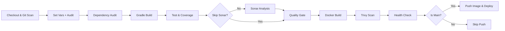

# DevOps-Stack-Test-Repo-Java

## 📘 Enterprise-Grade CI/CD Pipeline for Java (Gradle) Apps with Jenkins

This repository delivers a **production-ready DevSecOps pipeline** for building, testing, scanning, and deploying a Dockerized Java (Gradle-based) application using **Jenkins Declarative Pipelines**.

Designed for scalability, traceability, and security, this solution aligns with best practices for multistage pipelines, security hardening, quality gates, and structured auditing. 

---

## 🚀 Core Highlights

- 🧪 Git-based multibranch CI/CD with dynamic environments (`main`, `staging`, `develop`, `release/*`)
- 🕵️‍♂️ Secrets scanning with `git-secrets` and `gitleaks`
- ✅ Secure Jenkins credentials injection + SBOM-based validation
- 📈 Test reporting + coverage using JUnit, JaCoCo, and HTML reports
- 🛡️ Vulnerability scans using OWASP Dependency Check + Trivy
- 📆 SBOM generation for both source and container
- 🔍 Static code analysis with SonarQube + enforced quality gate
- 🏷️ OCI labels + Cosign signing for Docker images
- ⚠️ Granular failure tracking + categorized error logging
- 📂 Full pipeline-audit.json trace with metadata, durations, and test summaries

---

## 🧰 Folder Structure

```bash
repo-root/
├── Jenkinsfile                   # Jenkins CI/CD pipeline
├── Dockerfile                    # Container build logic
├── build.gradle                  # Gradle build script
├── gradle.properties             # Project version/config
├── src/                          # Java source code
├── build/                        # Build output
├── reports/                      # Git metadata & test reports
├── sbom-container.json           # CycloneDX container SBOM
├── pipeline-audit.json           # Full audit trail
├── build-info.json               # Metadata snapshot
├── test-summary.json             # Executed test stats
└── README.md
```

---

## 🔧 Jenkins Environment Assumptions

| Component         | Configuration Summary                                  |
|------------------|--------------------------------------------------------|
| Jenkins Agent     | Label: `java`, Docker + JDK + Gradle pre-installed     |
| Credentials       | Injected via `dockerhub-credentials`, `cosign.key`     |
| SCM               | GitHub (SSH/HTTPS)                                     |
| SonarQube         | Named instance `SonarQube` in Jenkins config           |
| Tools             | Java 17+, Gradle, Trivy, OWASP tools, Hadolint         |

---

## ♻️ Pipeline Stage Overview

### 1. **Enhanced Checkout**
- Git clone with shallow depth
- Secrets scan (`git-secrets`, `gitleaks`)
- Git metadata capture: author, diff impact, tags, merge, file type changes

### 2. **Set Variables**
- Detect commit hash, project version, resource limits, environment
- Tag images: `app:<commit>-<build>` and `app:latest`
- Compute intelligent cache key

### 3. **Audit Setup**
- Generate full audit JSON
- Captures triggering user, branch, environment, and all pipeline params

### 4. **Dependency Audit**
- Vulnerability scans via OWASP + DependencyCheck
- Outdated packages and license scan
- JSON summary of direct/transitive dependencies

### 5. **Build**
- Clean Gradle build with caching, parallel threads
- Output `build-info.json` with Java/Gradle version, commit, user

### 6. **Test & Coverage**
- Run tests with JaCoCo + JUnit
- Generate test-summary.json
- Coverage reports as HTML
- Categorize failure reasons: OOM, assertion, null, timeouts, etc.

### 7. **SonarQube Analysis** *(optional)*
- Static analysis for code quality, smells, and coverage review

### 8. **Quality Gate**
- Abort pipeline if SonarQube quality gate fails

### 9. **Artifact Publication**
- Archive `.jar`, `checksums.txt`, and SBOM

### 10. **Build Docker Image**
- BuildKit support, metadata, labels, multi-tag
- Security linter (Hadolint + grep rules)

### 11. **Scan Docker Image**
- Trivy CVE scanning (fail on HIGH/CRITICAL)
- Generate container SBOM (`sbom-container.json`)

### 12. **Health Check**
- Docker container health probes with retries
- Log collection and cleanup

### 13. **Push Docker Image** *(main branch only)*
- Push `:latest` + version tag to Docker Hub
- Cosign-based image signing (if available)

### 14. **Deploy (Manual Gate)**
- Manual confirmation prompt before production deployment

### 15. **Post Cleanup**
- Docker prune + log cleanup + execution summary archive

---

## 🔐 Security Layers

| Layer                  | Practice Used                                     |
|------------------------|---------------------------------------------------|
| Secret scanning        | `git-secrets`, `gitleaks`                         |
| Dependency scanning    | `OWASP`, `dependencyCheck`, `outdated`, licenses |
| Dockerfile hardening   | `hadolint`, grep pattern checks                   |
| Container CVE scan     | `trivy` with severity filtering                   |
| Credential management  | Jenkins credential store                         |
| SBOM generation        | CycloneDX plugin + Trivy                         |
| Authenticity & signing | Cosign (optional but supported)                  |
| Health validation      | Docker `--health` with retry + logs              |

---

## 📦 Shared Library Compatibility

```groovy
@Library('jenkins-shared-lib') _

buildJava(
  repoName: 'wahbamousa/java-sample-app',
  sonarKey: 'DevOps-Stack-Test-Repo-Java',
  dockerCredentialsId: 'dockerhub-credentials'
)
```

Directory Example:
```bash
jenkins-shared-lib/
├── vars/
│   └── buildJava.groovy
├── src/org/devops/utils/
│   ├── GitUtil.groovy
│   ├── ErrorReporter.groovy
│   └── MetadataUtil.groovy
└── resources/templates/   # e.g., lint rules, Docker hints
```

---

## 📊 Visual CI/CD Flow



---

## 🔹 Best Practices Checklist

- [x] Enforce git secrets scanning
- [x] Use caching with fingerprinting
- [x] Fail on high-severity CVEs
- [x] Categorize test failures
- [x] Push only signed, validated containers
- [x] Archive all metadata for traceability
- [x] SBOM both source & image
- [x] Track contributors, merge status, recent commits

---

## 🔖 License

MIT License — Feel free to fork, enhance, or adapt.

---
